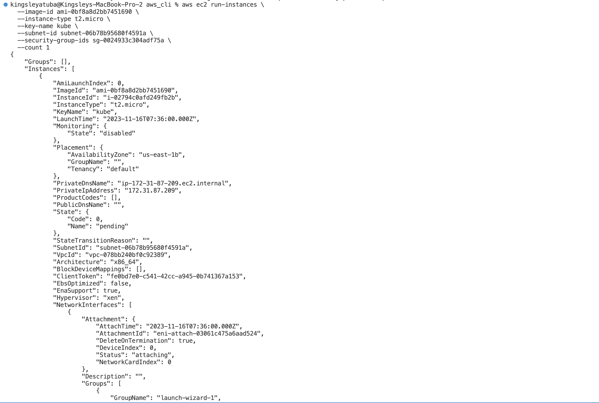
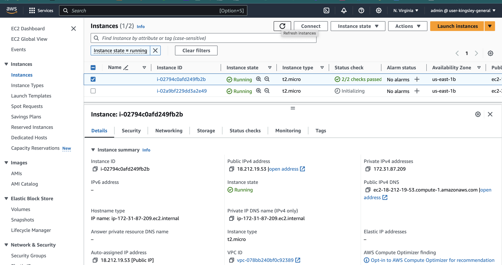
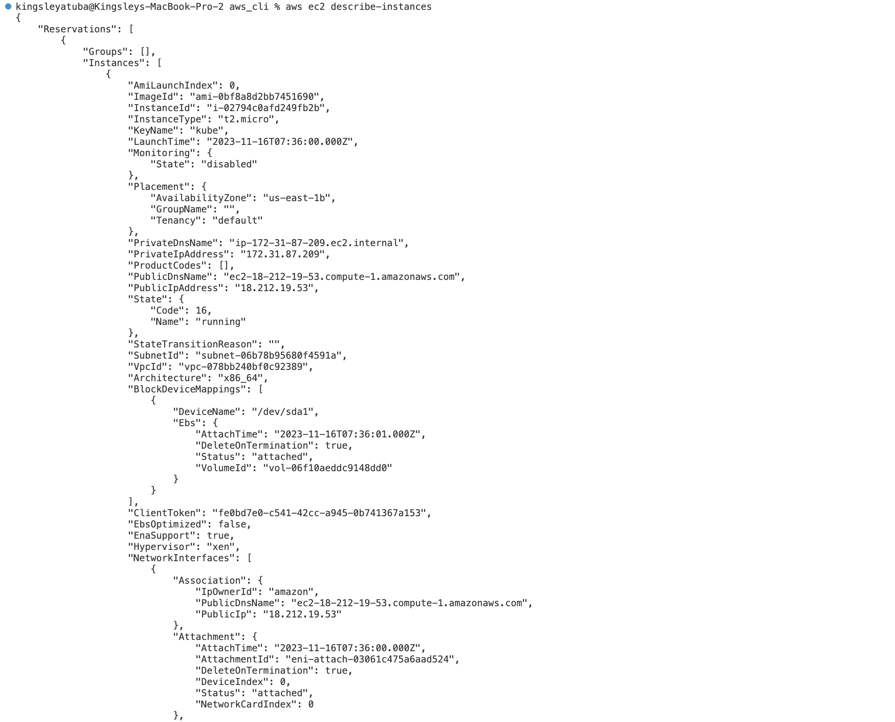
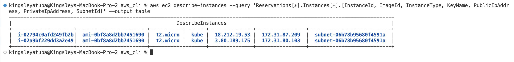
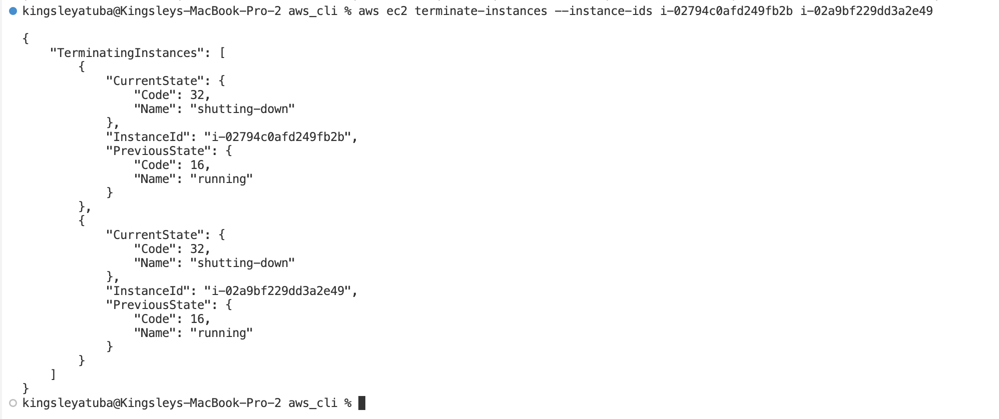
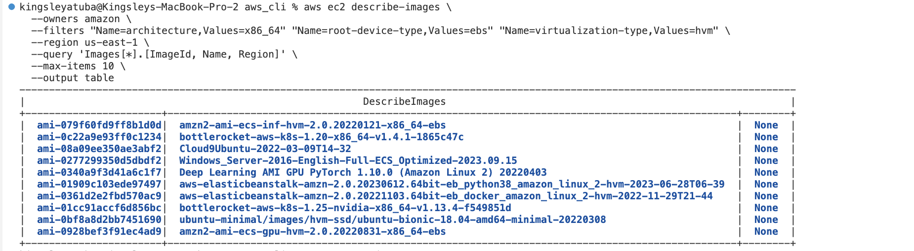

# Frequently Used AWS CLI Commands

## Create EC2 Instances

```
aws ec2 run-instances \
  --image-id ami-xxxxxxxxxxxxxxxxx \
  --instance-type t2.micro \
  --key-name your-key-pair-name \
  --subnet-id your-subnet-id \
  --security-group-ids your-security-group-id \
  --count 1
```

For example

```
aws ec2 run-instances \
  --image-id ami-0bf8a8d2bb7451690 \
  --instance-type t2.micro \
  --key-name kube \
  --subnet-id subnet-06b78b95680f4591a \
  --security-group-ids sg-0024933c304adf75a \
  --count 1
```





## List EC2 Instances

```
aws ec2 describe-instances
```



For a more concise output

```
aws ec2 describe-instances --query 'Reservations[*].Instances[*].[InstanceId, ImageId, InstanceType, KeyName, PublicIpAddress, PrivateIpAddress, SubnetId]' --output table
```



## Terminate EC2 Instances

```
aws ec2 terminate-instances --instance-ids i-02794c0afd249fb2b i-02a9bf229dd3a2e49
```



## find 10 AWS AMI images in us-east-1

```
aws ec2 describe-images \
  --owners amazon \
  --filters "Name=architecture,Values=x86_64" "Name=root-device-type,Values=ebs" "Name=virtualization-type,Values=hvm" \
  --region us-east-1 \
  --query 'Images[*].[ImageId, Name, Region]' \
  --max-items 10 \
  --output table
```



## List Key pairs

```
aws ec2 describe-key-pairs
```

## Create Key pairs

```
aws ec2 create-key-pair --key-name my-key-pair --query 'KeyMaterial' --output text > my-key-pair.pem
```

## List VPC

```
aws ec2 describe-vpc
```

## List Subnets

```
aws ec2 describe-subnets
```

## List Security Group

```
aws ec2 describe-security-groups
```

## Create Security Group

```
aws ec2 create-security-group --group-name YourSecurityGroupName --description "Your Security Group Description" --vpc-id YourVPCID
```

- Add inbound rules

```
aws ec2 authorize-security-group-ingress --group-id YourSecurityGroupId --protocol tcp --port 22 --cidr YourIPAddress/32
```
